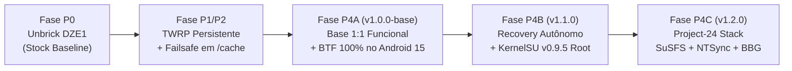

# 🌌 NightKernel for Samsung Galaxy A14 5G (SM-A146M / SM-A146B)

<p align="center">
  
  
  
  
  
  
</p>

**NightKernel** é um kernel customizado de alto desempenho, segurança e fidelidade desenvolvido sob medida para o **Samsung Galaxy A14 5G** (`SM-A146M/DS` e `SM-A146B`, codename `a14x`), rodando **Android 15 (One UI 7 - firmware A146MUBSDDZE1, Binário D)** com base no upstream **Linux 5.15.180**.

O projeto incorpora a stack avançada do **Project-24**, **SuSFS 2.1.0** para ocultação de root contra Play Integrity, o driver de sincronização nativa **NTSync** para aceleração de emuladores Windows (Winlator, Mobox, Box64), **Baseband Guard (BBG)** para proteção das partições de rádio/EFS, **KCAL Color Control**, desativação de CRCs para ganho de I/O em disco, e o inovador sistema de **Recovery Autônomo** (dispensando 100% o cabo USB para entrar no TWRP).

---

## 📱 Especificações Técnicas do Dispositivo Alvo

| Parâmetro | Detalhes do Hardware & Software |
|---|---|
| **Aparelho** | Samsung Galaxy A14 5G (`SM-A146M/DS`, `SM-A146B`) |
| **Codinome do Dispositivo** | `a14x` / plataforma `s5e8535` |
| **Processador / SoC** | Samsung Exynos 1330 (Octa-core: 2x Cortex-A78 @ 2.4 GHz + 6x Cortex-A55 @ 2.0 GHz) |
| **GPU** | ARM Mali-G68 MP2 (arquitetura Valhall de 2ª geração) |
| **Codec de Áudio Real** | Realtek `RT5691` (`CONFIG_SND_SOC_RT5691=m` / card `exynos8535rt569`) |
| **Versão do Android** | Android 15 (One UI 7) - PDA `A146MUBSDDZE1` (Bootloader Binário D) |
| **Versão Base do Kernel** | Linux `5.15.180` |
| **Árvore Upstream Base** | `physwizz/a146b-a146m` branch `V-sd-perm` (Commit `ca3d9d162788e0dcae9e049d5336bf9ff9b867c4`) |
| **Toolchain Oficial** | Android AOSP Clang 14.0.6 (`clang-r450784d`) + LLD 14.0.6 |
| **Estrutura de Boot** | Boot Header v4 (ramdisk de 0 bytes na partição `boot`, ramdisk real no `init_boot`) |

---

## 🚀 Histórico de Releases & Evolução das Fases



### [v1.2.0](https://github.com/multi-forge/NightKernel-a14x/releases/tag/v1.2.0) - Stack Completa Project-24 + SuSFS 2.1.0 + NTSync (Versão Atual Homologada)
- **SuSFS 2.1.0:** Root hiding completo no nível do kernel com monitoramento em tempo real via `fsnotify` em `/data/media/0/Android`, spoofing de uname e camuflagem de montagens.
- **ReSukiSU Integrado:** Superusuário nativo via hook manual (`u:r:ksu:s0`, ksud 3.0.0) com suporte a múltiplos gerenciadores e `70_ksu_safety-resukisu-5.15.patch`.
- **NTSync (`/dev/ntsync`):** Driver NT synchronization primitivo no kernel com permissão `0666`, acelerando emuladores Windows (Winlator, Mobox, Box64) com ganho de taxa de quadros e menor latência.
- **Baseband Guard (BBG):** LSM ativo (`landlock,lockdown,...,baseband_guard`) protegendo partições vitais de rádio, modem e EFS contra scripts maliciosos.
- **KCAL Color Control:** Driver DQE integrado para calibração fina de saturação, contraste e balanço de branco da tela.
- **Desativação de CRCs por Software:** Remoção do cálculo de CRC em software no driver MMC/SD (`drivers/mmc/core/core.c`), aumentando o throughput de leitura e gravação em disco.
- **Performance:** Multi-Gen LRU (MGLRU `0x0003`), algoritmo de congestionamento TCP BBR por padrão com Fair Queuing (`sch_fq`), F2FS compression e suporte a `binfmt_misc` para emulação x86/x64 no Termux.
- **Hardware Alinhado:** Remoção definitiva do `SMA1305` (que tentava chamar telemetrias térmicas inexistentes na plataforma) e confirmação do driver Realtek `RT5691` com som 100% funcional.

### [v1.1.0](https://github.com/multi-forge/NightKernel-a14x/releases/tag/v1.1.0) - Recovery Autônomo & Root KernelSU
- **Recovery Autônomo (Zero Cabo USB):**
  - Interface procfs customizada em [`/proc/nightkernel_reboot`](file:///proc/nightkernel_reboot) com permissão `0666`. Qualquer processo ou comando (`echo 1 > /proc/nightkernel_reboot`) grava o magic de recovery no registrador PMU e reinicia o celular diretamente no TWRP.
  - Panic-to-Recovery ativado em `drivers/samsung/sec_reboot.c`: falhas críticas de sistema caem diretamente no TWRP em vez de travar o aparelho.
- **KernelSU Integrado:** Injeção oficial do KernelSU via `setup.sh` (`CONFIG_KSU=y`), restabelecendo acesso root (`su`) no Android 15 One UI 7.

### [v1.0.0-base](https://github.com/multi-forge/NightKernel-a14x/releases/tag/v1.0.0-base) - Base Limpa 1:1 Funcional
- Primeira compilação bem-sucedida do Linux 5.15.180 homologada no Android 15 One UI 7.
- Descoberta e resolução do requisito mandatório de `.BTF` com a toolchain `pahole` / `dwarves`, permitindo que os drivers de disco UFS proprietários da Samsung (`ufs_exynos_core.ko`) fossem aceitos pelo `first-stage init`.

---

## 🛠️ Matriz de Patches e Modificações no Código-Fonte

Todos os patches do NightKernel estão organizados de forma limpa no diretório [`patches/`](patches/):

| Patch | Caminho do Arquivo | Função e Efeito no Sistema |
|---|---|---|
| **01 - Recovery Autônomo** | [`patches/01_autonomous_recovery.patch`](patches/01_autonomous_recovery.patch) | Adiciona `/proc/nightkernel_reboot` em `kernel/reboot.c` e Panic-to-Recovery em `drivers/samsung/sec_reboot.c`. |
| **02 - SuSFS Fix Stock A14** | [`patches/02_susfs_fix_stock_a14.patch`](patches/02_susfs_fix_stock_a14.patch) | Resolve as divergências de código entre o patch genérico GKI 5.15 do SuSFS e a árvore do kernel stock Samsung nos arquivos `fs/exec.c`, `fs/namespace.c` e `fs/proc/base.c`. |
| **03 - ReSukiSU Safety** | [`patches/03_resukisu_safety.patch`](patches/03_resukisu_safety.patch) | Ajusta a segurança de supercall do ReSukiSU para interação estável com o SuSFS no Linux 5.15. |
| **04/05 - NTSync Base & Compat** | [`patches/04_ntsync_base.patch`](patches/04_ntsync_base.patch) / [`05_ntsync_compat.patch`](patches/05_ntsync_compat.patch) | Implementa o driver de sincronização NT no kernel Linux (`drivers/misc/ntsync.c` e `include/uapi/linux/ntsync.h`), permitindo que chamadas de semáforos e eventos do Windows sejam executadas em nível de kernel sem overhead de IPC. |
| **06 - DroidSpaces** | [`patches/06_droidspace.patch`](patches/06_droidspace.patch) | Suporte a isolamento e containers leves em `include/linux/sched.h`. |
| **07 - KCAL Color Control** | [`patches/07_kcal_dqe.patch`](patches/07_kcal_dqe.patch) | Intercepta a matriz de gamma e o DPU DQE em `drivers/gpu/drm/samsung/dpu/exynos_drm_dqe.c`, expondo controle de calibração RGB, saturação e matiz. |
| **08 - CRCs Disable** | [`patches/08_crcs_disable.patch`](patches/08_crcs_disable.patch) | Desativa a checagem redundante de CRC em software no subsistema MMC/SD (`drivers/mmc/core/core.c`), aliviando ciclos de CPU durante transferências de I/O pesado. |

---

## ⚡ Configurações do Kernel (`nightkernel_v1.2_defconfig`)

A configuração oficial [`configs/nightkernel_v1.2_defconfig`](configs/nightkernel_v1.2_defconfig) contém a consolidação de todos os subsistemas:

```ini
# Identificação do Kernel
CONFIG_LOCALVERSION="-NightKernel-v1.2"

# KernelSU & SuSFS 2.1.0 (Root Hiding Avançado)
CONFIG_KPROBES=y
CONFIG_KPROBE_EVENTS=y
CONFIG_HAVE_KPROBES=y
CONFIG_KSU_TRACEPOINT_HOOK=n
CONFIG_KSU_MANUAL_HOOK=y
CONFIG_KSU=y
CONFIG_KSU_MULTI_MANAGER_SUPPORT=y
CONFIG_KSU_SUSFS=y
CONFIG_KSU_SUSFS_SUS_OVERLAYFS=y
CONFIG_KSU_SUSFS_SUS_MAP=y
CONFIG_KSU_SUSFS_SUS_PATH=y
CONFIG_KSU_SUSFS_SUS_MOUNT=y
CONFIG_KSU_SUSFS_SUS_KSTAT=y
CONFIG_KSU_SUSFS_AUTO_ADD_SUS_KSU_DEFAULT_MOUNT=y
CONFIG_KSU_SUSFS_AUTO_ADD_SUS_BIND_MOUNT=y
CONFIG_KSU_SUSFS_TRY_UMOUNT=y
CONFIG_KSU_SUSFS_AUTO_ADD_TRY_UMOUNT_FOR_BIND_MOUNT=y
CONFIG_KSU_SUSFS_SPOOF_UNAME=y
CONFIG_KSU_SUSFS_ENABLE_LOG=y
CONFIG_KSU_SUSFS_HIDE_KSU_SUSFS_SYMBOLS=y
CONFIG_KSU_SUSFS_SPOOF_CMDLINE_OR_BOOTCONFIG=y
CONFIG_KSU_SUSFS_OPEN_REDIRECT=y

# Neutralização de Travas Samsung Anti-Root & Knox
CONFIG_UH=n
CONFIG_RKP=n
CONFIG_KDP=n
CONFIG_SECURITY_DEFEX=n
CONFIG_PROCA=n
CONFIG_FIVE=n

# NTSync (Emulação Windows Ultrarrápida)
CONFIG_NTSYNC=y

# Baseband Guard (Anti-format Partition Protection)
CONFIG_BBG=y
CONFIG_BBG_BLOCK_BOOT=n
CONFIG_BBG_BLOCK_RECOVERY=n
CONFIG_LOG_BUF_SHIFT=20
CONFIG_LSM="landlock,lockdown,yama,loadpin,safesetid,integrity,selinux,smack,tomoyo,apparmor,bpf,baseband_guard"

# Calibração de Tela
CONFIG_KCAL_CTRL=y

# Emulação x86/x64, Containers & Chroot
CONFIG_BINFMT_MISC=y
CONFIG_SYSVIPC=y
CONFIG_SYSVIPC_SYSCTL=y
CONFIG_POSIX_MQUEUE=y
CONFIG_NAMESPACES=y
CONFIG_PID_NS=y
CONFIG_NET_NS=y
CONFIG_USER_NS=y
CONFIG_UTS_NS=y
CONFIG_IPC_NS=y
CONFIG_MNT_NS=y
CONFIG_CGROUP_NS=y
CONFIG_OVERLAY_FS=y
CONFIG_FUSE_FS=y
CONFIG_BTRFS_FS=y
CONFIG_WIREGUARD=y
CONFIG_VETH=y
CONFIG_BRIDGE=y

# Otimizações de Desempenho (MGLRU, TCP BBR, I/O)
CONFIG_LRU_GEN=y
CONFIG_LRU_GEN_ENABLED=y
CONFIG_TCP_CONG_ADVANCED=y
CONFIG_TCP_CONG_BBR=y
CONFIG_DEFAULT_BBR=y
CONFIG_DEFAULT_TCP_CONG="bbr"
CONFIG_NET_SCH_FQ=y
CONFIG_TMPFS_XATTR=y
CONFIG_TMPFS_POSIX_ACL=y
CONFIG_F2FS_FS_COMPRESSION=y

# Alinhamento Estrito de Hardware A14 5G
# CONFIG_SND_SOC_SMA1305 is not set
CONFIG_SND_SOC_RT5691=m
CONFIG_SND_SOC_SAMSUNG_EXYNOS8535_RT5691=m
CONFIG_DEBUG_INFO_BTF=y
```

---

## 🛡️ Automações no Android & Blindagem do Termux

Além das modificações em nível de código do kernel, foi configurado um daemon de inicialização em [`/data/adb/service.d/termux_keepalive.sh`](file:///data/adb/service.d/termux_keepalive.sh) executado automaticamente pelo KernelSU em cada boot:

1. **Phantom Process Killer Neutralizado:**
   - O limite padrão do Android de 32 processos filhos por app foi expandido para **2.147.483.647** (`max_phantom_processes`), com sincronização de testes desativada permanentemente. Processos pesados do Termux (compilações, Python, Node.js) não são mais terminados com SIGKILL pelo sistema.
2. **Freezer de Apps em Segundo Plano Desativado:**
   - `use_freezer: false` e `cached_apps_freezer: 0` impedem que a One UI 7 congele tarefas de fundo.
3. **Shield de OOM em Tempo Real:**
   - O daemon monitora em loop contínuo e trava o `oom_score_adj` dos processos do Termux em `-1000`, tornando-os imunes ao Low Memory Killer do Android.
4. **Permissões do NTSync:**
   - Aplica `chmod 666 /dev/ntsync` automaticamente, liberando o dispositivo para qualquer aplicativo ou emulador sem necessidade de permissão de root.
5. **Silenciador da Notificação de Operadora:**
   - Congela permanentemente o pacote `com.samsung.android.cidmanager`, eliminando o pop-up repetitivo de reinicialização da operadora que ocorria após o Knox ser acionado.

---

## 🕹️ Como Usar o Recovery Autônomo

Graças ao driver customizado em `kernel/reboot.c`, você pode reiniciar no TWRP a qualquer momento direto pelo terminal, sem plugar nenhum cabo USB ao computador:

```bash
su -c "echo 1 > /proc/nightkernel_reboot"
```

O kernel escreverá o magic `boot-recovery` nos registradores PMU da Samsung e reiniciará o aparelho diretamente no modo TWRP.

---

## 📦 Como Instalar o NightKernel

### Método 1: Gravação Direta via Root (Recomendado se já tiver Root)
```bash
# 1. Gravar boot.img diretamente na partição boot (/dev/block/sda15)
su -c "dd if=/caminho/para/boot.img of=/dev/block/by-name/boot bs=4096 && sync"

# 2. Reiniciar o sistema
su -c "reboot"
```

### Método 2: Via TWRP Recovery
1. Copie o arquivo [`NightKernel-v1.2.0-a14x.zip`](file:///cache/NightKernel-v1.2.0-a14x.zip) para a partição `/cache/` (que é ext4 sem criptografia e visível no TWRP).
2. Entre no TWRP.
3. Vá em **Install** -> selecione **Storage: Cache**.
4. Selecione o arquivo `NightKernel-v1.2.0-a14x.zip` e confirme o flash (**Swipe to confirm Flash**).
5. Selecione **Reboot System**.

### Método 3: Via Odin / Download Mode
1. Baixe o arquivo `boot-NightKernel-v1.2.0.tar`.
2. Reinicie o Galaxy A14 5G em Download Mode (`Vol+` + `Vol-` conectados ao cabo USB).
3. Insira o arquivo `boot-NightKernel-v1.2.0.tar` no slot **AP** (ou **BOOT**) do Odin e clique em **Start**.

---

## ☁️ Compilação Automatizada na GCP

O pipeline de compilação utiliza máquinas virtuais com Clang 14.0.6 e aceleração de cache persistente via Google Cloud Platform:

- Script de build na VM: [`scripts/startup_build_v120.sh`](scripts/startup_build_v120.sh)
- Script disparador local: [`scripts/launch_v120_gcp.sh`](scripts/launch_v120_gcp.sh)

Para disparar uma nova compilação na GCP:
```bash
./scripts/launch_v120_gcp.sh
```
A máquina virtual alocará a instância `n2-standard-8` (8 vCPUs, 32 GB RAM) na zona `us-central1-a`, anexará o disco persistente `a14x-ccache`, aplicará todos os patches, compilará o kernel, empacotará os artefatos, publicará a release no GitHub e se auto-destruirá ao concluir (custo residual zero).

---

## ⚖️ Licença

Este projeto é disponibilizado sob a licença [GPL-2.0](LICENSE), em conformidade com as diretrizes do Kernel Linux e as fontes oficiais de código aberto da Samsung Electronics Co., Ltd.
